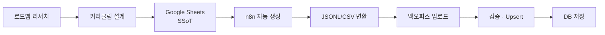

<div align="center">

  

  <p>
    <a href="https://funda.website"><strong>🌐 배포 사이트</strong></a> • 
    <a href="https://github.com/boostcampwm2025/web21-funda/wiki"><strong>📚 프로젝트 위키</strong></a>
  </p>

---

**Funda**는 지루한 CS 공부를 즐거운 습관으로 바꾸는 **게이미피케이션 학습 플랫폼**입니다.<br/>
복잡한 이론 학습을 넘어, 개인 맞춤형 성장을 경험하세요.

  <br/>

| 🗺️ 체계적인 로드맵  |   🧩 게임형 퀴즈   |  ⚔️ 실시간 배틀  | 🏆 랭킹 시스템 |  🤖 AI 학습 지원   | 🔄 자동 복습(SRS) |
| :-----------------: | :----------------: | :--------------: | :------------: | :----------------: | :---------------: |
| 끊김 없는 학습 경로 | 재미있는 지식 습득 | 몰입형 경쟁 학습 | 티어 기반 성장 | 개인 맞춤형 가이드 |  장기 기억 형성   |

</div>

<br/>
<br/>

## 🎯 프로젝트 소개

**Funda**는 세 가지 핵심 가치를 바탕으로 개발자의 성장을 돕습니다.

| 🎮 **Fun**                                                     | 📅 **Daily**                                               | 📈 **Growth**                                          |
| :------------------------------------------------------------- | :--------------------------------------------------------- | :----------------------------------------------------- |
| **지속 가능한 즐거움**                                         | **일상의 습관**                                            | **가시적인 보상**                                      |
| 학습 자체가 놀이가 되어<br/>포기하지 않는 원동력을 제공합니다. | 부담 없는 데일리 퀴즈로<br/>매일 조금씩 지식을 쌓아갑니다. | 레벨업과 데이터를 통해<br/>성장하는 실력을 확인합니다. |

<br/>

## ✨ 주요 기능

### 🗺️ 체계적인 학습 로드맵

학습자가 길을 잃지 않도록 **4단계 계층 구조**의 정교한 커리큘럼을 제공합니다.

<div align="center">
  <br/>
  <b>Field</b> (분야) &nbsp;→&nbsp; <b>Unit</b> (챕터) &nbsp;→&nbsp; <b>Step</b> (단위) &nbsp;→&nbsp; <b>Quiz</b> (실전)
  <br/>
  <code>프론트엔드 / 백엔드 / 모바일 / CS 기초 / 알고리즘 / 게임 개발 / 데이터·AI 기초 / 데브옵스</code>
  <br/><br/>
</div>

- **업계 표준 가이드라인:** 최신 기술 트렌드를 반영한 직무별 필수 역량 로드맵 제공
- **원자적 학습 설계:** 최소 학습 단위(Step) 구성을 통해 심리적 진입장벽 최소화
- **유연한 확장성:** 난이도와 세부 전공에 따라 커스터마이징 가능한 데이터 구조

<br/>

### 🔄 효율적인 장기 기억, SM-2 복습 알고리즘

단순히 문제를 푸는 것을 넘어, **완벽히 내 것으로 만드는** 학습 경험을 위해 검증된 알고리즘을 적용했습니다.

> **Spaced Repetition System (SRS)**
> Funda는 에빙하우스의 망각 곡선을 극복하기 위해 **SM-2(SuperMemo-2)** 알고리즘을 기반으로 최적의 복습 타이밍을 계산합니다.

- **지능적 인터벌 계산:** 사용자의 정답률과 체감 난이도에 따라 다음 복습 주기를 개별 산출합니다.
- **복습 주기 공식:** $I(n) = I(n-1) \times EF$
- **효율 극대화:** 아는 문제는 건너뛰고, 틀린 문제 위주로 노출하여 학습 시간을 획기적으로 단축합니다.

<br/>

### 🎯 다양한 퀴즈 형식 & 실전 대비

다양한 문제 유형을 통해 단순 암기가 아닌 **구조적 이해**를 돕습니다.

| 퀴즈 타입           | 특징 및 설명                                | 학습 목표           |
| :------------------ | :------------------------------------------ | :------------------ |
| **객관식 (MCQ)**    | 가장 표준적인 개념 체크 방식                | 핵심 키워드 인지    |
| **O/X 퀴즈**        | 흔히 헷갈리는 오개념(Anti-pattern) 바로잡기 | 정확한 개념 정립    |
| **매칭 (Matching)** | 개념과 정의, 혹은 기술 간의 관계 연결       | 구조적 관계 파악    |
| **코드 분석**       | 실제 코드 스니펫의 실행 결과 및 로직 추론   | 실전 적용 능력 배양 |

<br/>

### ⚔️ 실시간 배틀

단순히 혼자 푸는 것을 넘어, 다른 학습자와 실시간으로 경쟁하며 실력을 증명하세요.

- **실시간 상태 동기화:** `Socket.io` 기반의 서버 메모리 상태 관리로 끊김 없는 멀티플레이 구현
- **무한 확장 매칭:** 초대 링크로 간편하게 참여하고, 최대 25인까지 동시 배틀 가능
- **정밀한 타이머:** 서버 시간 기반의 검증 로직을 통해 모든 참가자에게 공정한 제한 시간 제공
- **실시간 스코어보드:** 상위 랭커의 점수 변화를 실시간으로 확인하며 극대화된 몰입감 경험

<br/>

### 🏆 주간 랭킹: 티어로 증명하는 나의 위치

매주 초기화되는 XP를 기반으로, **[상대 평가 + 절대 기준]**이 결합된 정교한 티어 시스템을 운영합니다.

|     티어 (Tier)     | 승급/유지 규칙        | 특이 사항                                |
| :-----------------: | :-------------------- | :--------------------------------------- |
|     **MASTER**      | 하위권 강등 중심 설계 | 최상위권의 가치를 보존하는 하드코어 구간 |
| **RUBY / SAPPHIRE** | 상위 % + 절대 XP 컷   | 치열한 경쟁이 발생하는 상위 구간         |
|  **GOLD / SILVER**  | 상위 % + 절대 XP 컷   | 가장 활발한 학습이 일어나는 메인 구간    |
|     **BRONZE**      | 학습 시작 티어        | 기초 지식 습득 및 랭킹 진입 구간         |

- **동적 승급 기준:** 경쟁이 치열할수록 승급 최소 XP가 자동으로 상향되어 티어의 변별력 유지
- **활동 우선권 시스템:** 한정된 티어 슬롯(10인)을 기반으로 선착순 활동 우선 배정 로직 적용

<br/>

### 👤 개인화 및 AI 학습 지원

나만의 학습 데이터와 AI 기술을 결합하여 최적화된 학습 환경을 제공합니다.

- **🤖 AI 학습 튜터:** 퀴즈 풀이 중 실시간 Q&A 및 정밀 오답 해설을 통해 학습 흐름 유지
- **📊 학습 대시보드:** 나의 주간 XP 추이와 약점 분야를 데이터로 시각화하여 메타인지 향상
- **🌱 지식 잔디:** GitHub 스타일의 학습 기록 시각화로 매일의 성취감을 기록
- **⚡ 하트 & 캐릭터:** 제한된 기회로 집중도를 높이고, 획득한 다이아로 나만의 프로필 구축

## 🏗️ 기술적 특징

### 🧪 콘텐츠 생성 파이프라인

<div align="center">

**"대량 콘텐츠를 *수동 작업*에서 *원클릭 자동화*로"**  
_Google Sheets × n8n × Gemini로 안정적인 대규모 퀴즈 생산 라인 구축_

</div>



**AI 기반 자동 퀴즈 생성**으로 고품질 콘텐츠를 안정적으로 확보합니다.

| 구분             | 핵심 역할                            | 결과물            |
| ---------------- | ------------------------------------ | ----------------- |
| **워크플로우 1** | 필드/유닛/스텝 커리큘럼 자동 생성    | 커리큘럼 CSV/JSON |
| **워크플로우 2** | 커리큘럼 기반 퀴즈 6,000개 대량 생성 | JSONL/CSV 퀴즈셋  |

<br/>

**설계 의도 (핵심 3가지)**

- **Single Source of Truth:** 로컬 경로 의존 제거, Google Sheets 중심 운영
- **안정성 우선:** 배치 처리 + Wait로 LLM 응답 불안정 최소화
- **스키마 신뢰성 확보:** 엄격 스키마는 분리하고 Code 노드 후처리로 보완

<br/>

**운영 가드레일**

- **배치 크기 제한:** Unit 단위 처리로 실패 범위를 국소화
- **Wait 필수:** 대량 반복 호출 시 파싱 실패율 급감
- **에러 분기 대응:** 실패 item만 재시도 가능하도록 분리
- **파일 경로 표준화:** 컨테이너 경로(`/home/node/downloads`)로 저장

**🧩 n8n 파이프라인 상세**

- **Workflow 1:** Field/Unit/Step 커리큘럼 생성 → CSV/JSON 저장
- **Workflow 2:** 커리큘럼 기반 퀴즈셋 대량 생성 → JSONL/CSV 저장
- **배치 처리 + Wait:** 대량 호출 시 레이트리밋/파싱 실패 감소
- **Structured Output + 후처리:** 스키마 엄격도는 낮추고 Code 노드로 보정

### 📊 모니터링 스택

서비스 운영 지표와 장애 징후를 **메트릭 + 로그** 관점에서 함께 관측합니다.

| 구성 요소         | 역할        | 설명                               |
| ----------------- | ----------- | ---------------------------------- |
| **Prometheus**    | 메트릭 수집 | 서버 지표를 시계열로 저장          |
| **Grafana**       | 대시보드    | 메트릭/로그 통합 시각화            |
| **Loki**          | 로그 저장   | 애플리케이션 로그 중앙화           |
| **Promtail**      | 로그 수집   | 컨테이너 로그를 Loki로 전달        |
| **Node Exporter** | 시스템 지표 | CPU/메모리/디스크 등 호스트 메트릭 |

<br/>

### 🧭 프론트엔드 데이터 레이어

**TanStack Query + Suspense Query** 조합으로 화면 전환 속도와 데이터 일관성을 확보합니다.

- **캐시 기반 데이터 관리:** 재방문 시 빠른 렌더링, 불필요한 재요청 최소화
- **프리패치/무효화 전략:** 퀴즈 풀이 후 리더보드 등 연관 데이터 자동 동기화
- **Suspense 기반 로딩 제어:** 로딩 상태를 선언적으로 관리해 UI 복잡도 축소

<br/>

## 🚀 시작하기 (Docker)

### 사전 요구사항

- Docker / Docker Compose

### 1. 프로젝트 클론

```bash
git clone https://github.com/boostcampwm2025/web21-funda.git
cd web21-funda
```

### 2. 환경 변수 설정

```bash
# 백엔드
cp apps/backend/.env.example apps/backend/.env.local

# 프론트엔드
cp apps/frontend/.env.example apps/frontend/.env.local
```

### 3. Docker 네트워크 생성

```bash
docker network create funda-network
```

### 4. Docker 실행

```bash
docker compose -f docker/local/docker-compose.local.yml up -d --build
```

접속: `http://localhost:5173`

<br/>

## 🛠️ 기술 스택

### 🏗 Common Infrastructure

<div style="text-align: left;">
    
    
    
    
    
    
    
    
    
    
</div>

### 💻 Frontend

<div style="text-align: left;">
    
    
    
    
    
    
    
    
    
    
    
</div>

### 📡 Backend

<div style="text-align: left;">
    
    
    
    
</div>

### 🧪 Quality & Testing

<div style="text-align: left;">
    
    
    
    
    
    
</div>
