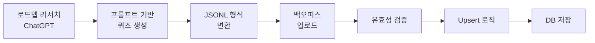

<div align="center">
    <h1>${{\color{#6559EA}\textsf{Funda}}}$</h1>
    <h3>💡 즐거운 학습 경험을 통해 개발자의 지속적인 성장을 돕습니다</h3>
    <br/>
    
**Funda**는 CS 지식 학습을 게임처럼 재미있게 바꾸는 웹 기반 학습 플랫폼입니다.<br/>
체계적인 로드맵과 다양한 퀴즈 형식, 게이미피케이션 요소로 지루한 공부를 즐거운 습관으로 만들어갑니다.<br/>
자동 복습 시스템(SRS)과 AI 기반 학습 지원으로 개인 맞춤형 학습 경험을 제공합니다.
</div>
<br/>

## 🎯 프로젝트 소개

Funda는 **Fun(즐거움)**, **Daily(일상)**, **Growth(성장)** 세 가지 핵심 가치를 중심으로 설계되었습니다.

- 🎮 **Fun:** 학습은 즐거워야 지속 가능합니다
- 📅 **Daily:** 매일 조금씩 쌓는 지식의 힘
- 📈 **Growth:** 눈에 보이는 성장과 보상

<br/>

## ✨ 주요 기능

### 🗺️ 체계적인 학습 로드맵

```
Frontend / Backend / CS / Mobile / Game / Algorithm / AI / DevOps
    └─ Field (분야)
        └─ Unit (챕터)
            └─ Step (최소 학습 단위)
                └─ Quiz (실전 문제)
```

**Field → Unit → Step → Quiz** 의 4단계 계층 구조로 설계되어:

- 업계 표준 로드맵을 반영한 최신 커리큘럼 제공
- 에빙하우스 망각 곡선 기반 **SRS(Spaced Repetition System)** 복습 알고리즘 적용 예정
- 난이도별 유연한 확장이 가능한 구조

<br/>

### 🎯 다양한 퀴즈 형식

| 퀴즈 타입        | 설명                       | 학습 목표        |
| ---------------- | -------------------------- | ---------------- |
| **객관식 (MCQ)** | 기본 개념 이해도 체크      | 핵심 개념 이해   |
| **O/X**          | 자주 하는 오해 포인트 확인 | 정확한 개념 정립 |
| **매칭**         | 관련 항목 연결 짓기        | 구조적 이해      |
| **코드 포함**    | 실제 코드 스니펫 분석      | 실전 적용 능력   |

<br/>

### 🎮 게이미피케이션

- 🏆 XP 보상 & 레벨 시스템: 학습에 따른 보상 시각화
- 🏅 랭킹 시스템: 다른 학습자들과 경쟁하며 동기부여
- ⚡ 하트 시스템: 적절한 긴장감으로 집중도 향상
- 🌱 지식 잔디: GitHub처럼 매일의 학습을 시각화

### 🤖 AI 학습 지원

- 💬 실시간 질의응답: 퀴즈 풀이 중 궁금한 점을 AI에게 바로 질문
- 📝 상세한 오답 해설: 틀린 문제에 대한 개념 설명과 학습 가이드

### 👤 개인화

- 📊 학습 대시보드: 나의 학습 패턴과 진도를 한눈에 파악
- 🎯 맞춤형 복습: 약점을 자동으로 분석하여 복습 문제 추천
- 🦊 캐릭터 프로필: 수집한 캐릭터로 나만의 프로필 꾸미기

<br/>

## 🏗️ 기술적 특징

### 콘텐츠 생성 파이프라인



**AI 기반 자동 퀴즈 생성**으로 고품질 콘텐츠를 효율적으로 확보:

- ChatGPT 리서치 기능으로 업계 표준 로드맵 조사
- 정교한 프롬프트 엔지니어링으로 일관된 품질 유지
- JSONL 형식으로 한 줄당 완전한 퀴즈 데이터 포함
- 백오피스를 통한 대량 업로드 및 자동 ID/순서 생성

### 코드 퀴즈 구조

실전 코딩 능력을 테스트하기 위한 특별한 데이터 구조:

```json
{
  "type": "code",
  "question": "다음 코드의 출력 결과는?",
  "content": {
    "code": "const arr = [1, 2, 3];\nconsole.log(arr.map(x => x * 2));",
    "language": "javascript",
    "options": {
      "c1": "[2, 4, 6]",
      "c2": "[1, 2, 3, 2, 4, 6]",
      "c3": "6",
      "c4": "undefined"
    }
  },
  "answer": "c1",
  "difficulty": 2,
  "explanation": "map()은 배열의 각 요소에 함수를 적용하여 새 배열을 반환합니다."
}
```

<br/>

## 🚀 시작하기

### 사전 요구사항

- Node.js 18.x 이상
- pnpm 8.x 이상
- MySQL 8.x

### 1. 프로젝트 클론

```bash
git clone https://github.com/boostcampwm2025/web21-funda.git
cd web21-funda
```

### 2. 의존성 설치

```bash
# pnpm이 설치되어 있지 않다면
npm install -g pnpm

# 의존성 설치 (루트 디렉토리에서)
pnpm install
```

### 3. 환경 변수 설정

```bash
# 프론트엔드
cp apps/client/.env.example apps/client/.env

# 백엔드
cp apps/server/.env.example apps/server/.env
```

### 4. 데이터베이스 설정

```bash
# MySQL 데이터베이스 생성
mysql -u root -p
CREATE DATABASE funda;
```

### 5. 개발 서버 실행

```bash
# 전체 프로젝트 실행
pnpm run dev

# 또는 개별 실행
pnpm --filter client dev    # 프론트엔드만
pnpm --filter server dev    # 백엔드만
```

접속: `http://localhost:5173`

<br/>

## 🛠️ 기술 스택

### 🏗 Common Infrastructure

<div style="text-align: left;">
    
    
    
    
    
</div>

### 💻 Frontend

<div style="text-align: left;">
    
    
    
    
    
    
    
    
</div>

### 📡 Backend

<div style="text-align: left;">
    
    
    
</div>

### 🧪 Quality & Testing

<div style="text-align: left;">
    
    
    
    
    
    
</div>
