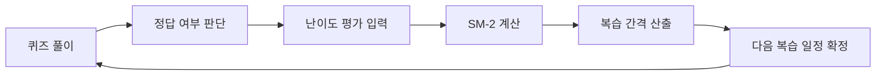

<div align="center">
  

  <h1>Funda</h1>
  <p><strong>지루한 CS 공부를 즐거운 습관으로 바꾸는 게이미피케이션 학습 플랫폼</strong></p>

  <p>
    <a href="https://funda.website"><strong>🌐 배포 사이트</strong></a> •
    <a href="https://github.com/boostcampwm2025/web21-funda/wiki"><strong>📚 프로젝트 위키</strong></a>
  </p>

  <p>
    
    
    
    
    
  </p>

</div>

<br/>
<br/>

---

## ✨ 핵심 가치

| 🎮 Fun                                            | 📅 Daily                                            | 📈 Growth                                         |
| :------------------------------------------------ | :-------------------------------------------------- | :------------------------------------------------ |
| 학습이 놀이가 되어 포기하지 않는 동력을 만듭니다. | 부담 없는 데일리 퀴즈로 자연스러운 습관을 만듭니다. | 레벨업, 랭킹, 기록으로 성장을 눈에 보이게 합니다. |

---

## 🧭 문제와 해법

| 문제                                 | 해결                                                        |
| :----------------------------------- | :---------------------------------------------------------- |
| 학습이 지루하고 방향성을 잡기 어렵다 | **Field → Unit → Step → Quiz** 구조로 명확한 학습 경로 제공 |
| 꾸준함을 유지하기 어렵다             | 짧은 세션, 자동 복습, 랭킹으로 매일의 동기 부여             |
| 이해가 얕고 연결이 끊긴다            | AI 질의응답으로 개념 확장과 심화 학습 지원                  |

---

## 🗺️ 학습 구조

<div align="center">
  <b>Field</b> (분야) &nbsp;→&nbsp; <b>Unit</b> (챕터) &nbsp;→&nbsp; <b>Step</b> (단위) &nbsp;→&nbsp; <b>Quiz</b> (실전)
  <br/>
  <code>프론트엔드 / 백엔드 / 모바일 / CS 기초 / 알고리즘 / 게임 개발 / 데이터·AI 기초 / 데브옵스</code>
</div>

---

## 🧩 주요 기능

학습 진입부터 습관화, 심화 학습까지 **하나의 흐름**으로 연결되도록 설계했습니다.

| 기능                   | 설명                                                                                        |
| :--------------------- | :------------------------------------------------------------------------------------------ |
| **체계적인 로드맵**    | 최소 학습 단위(Step)로 심리적 진입 장벽을 낮추고, 확장 가능한 구조로 커리큘럼을 구성합니다. |
| **다양한 퀴즈 포맷**   | 객관식, OX, 매칭, 코드 분석을 통해 단순 암기보다 구조적 이해를 유도합니다.                  |
| **SM-2 복습 알고리즘** | 정답률과 체감 난이도를 기반으로 복습 주기를 계산해 장기 기억을 강화합니다.                  |
| **실시간 배틀**        | `Socket.io` 기반 동기화와 공정한 타이머로 몰입감 있는 경쟁 학습을 제공합니다.               |
| **주간 랭킹 & 티어**   | 상대 평가 + 절대 기준을 결합해 티어 변별력을 유지합니다.                                    |
| **AI 학습 지원**       | 실시간 Q&A와 오답 해설로 개념을 확장하고 학습 흐름을 유지합니다.                            |
| **개인 대시보드**      | 학습 기록과 약점 영역을 시각화해 메타인지를 높입니다.                                       |

### 🗺️ 체계적인 학습 로드맵

학습자가 길을 잃지 않도록 **4단계 계층 구조**의 정교한 커리큘럼을 제공합니다.

- **업계 표준 가이드라인:** 최신 기술 트렌드를 반영한 직무별 필수 역량 로드맵 제공
- **원자적 학습 설계:** 최소 학습 단위(Step) 구성을 통해 심리적 진입 장벽 최소화
- **유연한 확장성:** 난이도와 세부 전공에 따라 커스터마이징 가능한 데이터 구조

<table>
  <tr align="center">
    <td><strong>로드맵 화면</strong></td>
  </tr>
  <tr align="center">
    <td>
      
    </td>
  </tr>
</table>

### 🔄 효율적인 장기 기억, SM-2 복습 알고리즘

단순히 문제를 푸는 것을 넘어, **완벽히 내 것으로 만드는** 학습 경험을 위해 검증된 알고리즘을 적용했습니다.

> **Spaced Repetition System (SRS)**  
> Funda는 에빙하우스의 망각 곡선을 극복하기 위해 **SM-2(SuperMemo-2)** 알고리즘을 기반으로 최적의 복습 타이밍을 계산합니다.

- **지능적 인터벌 계산:** 사용자의 정답률과 체감 난이도에 따라 다음 복습 주기를 개별 산출합니다.
- **효율 극대화:** 아는 문제는 건너뛰고, 틀린 문제 위주로 노출하여 학습 시간을 획기적으로 단축합니다.



### 🎯 다양한 퀴즈 형식 & 실전 대비

다양한 문제 유형을 통해 단순 암기가 아닌 **구조적 이해**를 돕습니다.

| 퀴즈 타입           | 특징 및 설명                                | 학습 목표           |
| :------------------ | :------------------------------------------ | :------------------ |
| **객관식 (MCQ)**    | 가장 표준적인 개념 체크 방식                | 핵심 키워드 인지    |
| **O/X 퀴즈**        | 흔히 헷갈리는 오개념(Anti-pattern) 바로잡기 | 정확한 개념 정립    |
| **매칭 (Matching)** | 개념과 정의, 혹은 기술 간의 관계 연결       | 구조적 관계 파악    |
| **코드 분석**       | 실제 코드 스니펫의 실행 결과 및 로직 추론   | 실전 적용 능력 배양 |

<table>
  <tr align="center">
    <td colspan="2"><strong>퀴즈 플레이 화면</strong></td>
  </tr>
  <tr align="center">
    <td>
      
    </td>
    <td>
      
    </td>
  </tr>
  <tr align="center">
    <td>
      
    </td>
    <td>
      
    </td>
  </tr>
</table>

### ⚔️ 실시간 배틀

단순히 혼자 푸는 것을 넘어, 다른 학습자와 실시간으로 경쟁하며 실력을 증명하세요.

- **실시간 상태 동기화:** `Socket.io` 기반의 서버 메모리 상태 관리로 끊김 없는 멀티플레이 구현
- **무한 확장 매칭:** 초대 링크로 간편하게 참여하고, 최대 15인까지 동시 배틀 가능
- **정밀한 타이머:** 서버 시간 기반의 검증 로직을 통해 모든 참가자에게 공정한 제한 시간 제공
- **실시간 스코어보드:** 상위 랭커의 점수 변화를 실시간으로 확인하며 극대화된 몰입감 경험

<table>
  <tr align="center">
    <td colspan="2"><strong>실시간 배틀 화면</strong></td>
  </tr>
  <tr align="center">
    <td>
      
    </td>
    <td>
      
    </td>
  </tr>
  <tr align="center">
    <td>
      
    </td>
    <td>
      
    </td>
  </tr>
</table>

### 🏆 주간 랭킹: 티어로 증명하는 나의 위치

매주 초기화되는 XP를 기반으로, **상대 평가 + 절대 기준**이 결합된 정교한 티어 시스템을 운영합니다.

| 티어 (Tier)         | 승급/유지 규칙        | 특이 사항                                |
| :------------------ | :-------------------- | :--------------------------------------- |
| **MASTER**          | 하위권 강등 중심 설계 | 최상위권의 가치를 보존하는 하드코어 구간 |
| **RUBY / SAPPHIRE** | 상위 % + 절대 XP 컷   | 치열한 경쟁이 발생하는 상위 구간         |
| **GOLD / SILVER**   | 상위 % + 절대 XP 컷   | 가장 활발한 학습이 일어나는 메인 구간    |
| **BRONZE**          | 학습 시작 티어        | 기초 지식 습득 및 랭킹 진입 구간         |

- **동적 승급 기준:** 경쟁이 치열할수록 승급 최소 XP가 자동으로 상향되어 티어의 변별력 유지
- **활동 우선권 시스템:** 한정된 티어 슬롯(10인)을 기반으로 선착순 활동 우선 배정 로직 적용

<table>
  <tr align="center">
    <td><strong>주간 랭킹 화면</strong></td>
  </tr>
  <tr align="center">
    <td>
      
    </td>
  </tr>
</table>

### 🤖 AI 학습 튜터

퀴즈 풀이 중 **실시간 Q&A**와 정밀 오답 해설로 학습 흐름을 유지합니다.

- **AI 학습 튜터:** 질문의 맥락을 유지한 맞춤형 해설 제공
- **심화 질문 유도:** 개념을 넓히는 추가 질문으로 이해도 확장

<table>
  <tr align="center">
    <td><strong>AI 학습 화면</strong></td>
  </tr>
  <tr align="center">
    <td>
      
    </td>
  </tr>
</table>

### 📊 개인 대시보드

나만의 학습 기록을 **시각화**해 흐름을 확인하고 다음 학습을 설계합니다.

- **학습 대시보드:** 주간 XP 추이와 약점 분야를 데이터로 확인
- **지식 잔디:** GitHub 스타일의 학습 기록 시각화로 성취감 강화
- **하트 & 캐릭터:** 제한된 기회로 집중도를 높이고, 획득한 다이아로 프로필 구축

<table>
  <tr align="center">
    <td><strong>개인 대시보드</strong></td>
    <td><strong>캐릭터 프로필</strong></td>
  </tr>
  <tr align="center">
    <td>
      
    </td>
    <td>
      
    </td>
  </tr>
</table>

---

## 🧪 콘텐츠 생성 파이프라인

<div align="center">

**"대량 콘텐츠를 수동 작업에서 원클릭 자동화로"**  
_Google Sheets × n8n × Gemini로 대규모 퀴즈 생산 라인 구축_

</div>


- Field/Unit/Step 커리큘럼을 자동 생성해 안정적인 퀴즈 품질을 확보합니다.
- 배치 처리와 Wait로 LLM 응답 불안정을 최소화합니다.
- 스키마 신뢰성을 높이기 위해 후처리 로직을 분리합니다.

---

## 📊 모니터링 스택

| 구성 요소     | 역할        | 설명                        |
| :------------ | :---------- | :-------------------------- |
| Prometheus    | 메트릭 수집 | 서버 지표를 시계열로 저장   |
| Grafana       | 대시보드    | 메트릭/로그 통합 시각화     |
| Loki          | 로그 저장   | 애플리케이션 로그 중앙화    |
| Promtail      | 로그 수집   | 컨테이너 로그를 Loki로 전달 |
| Node Exporter | 시스템 지표 | CPU/메모리/디스크 모니터링  |

---

## 🧭 프론트엔드 데이터 레이어

**TanStack Query + Suspense Query** 조합으로 화면 전환 속도와 데이터 일관성을 확보합니다.

- 캐시 기반 데이터 관리로 재방문 시 빠른 렌더링을 제공합니다.
- 퀴즈 풀이 후 리더보드 등 연관 데이터를 자동 동기화합니다.
- 선언적 로딩 제어로 UI 복잡도를 낮춥니다.

---

## 🚀 시작하기 (Docker)

### 사전 요구사항

- Docker / Docker Compose

### 1. 프로젝트 클론

```bash
git clone https://github.com/boostcampwm2025/web21-funda.git
cd web21-funda
```

### 2. 환경 변수 설정

```bash
# 백엔드
cp apps/backend/.env.example apps/backend/.env.local

# 프론트엔드
cp apps/frontend/.env.example apps/frontend/.env.local
```

### 3. Docker 네트워크 생성

```bash
docker network create funda-network
```

### 4. Docker 실행

```bash
docker compose -f docker/local/docker-compose.local.yml up -d --build
```

접속: `http://localhost:5173`

---

## 🛠️ 기술 스택

### 🏗 Common Infrastructure

<div style="text-align: left;">
  
  
  
  
  
  
  
  
  
  
</div>

### 💻 Frontend

<div style="text-align: left;">
  
  
  
  
  
  
  
  
  
  
  
</div>

### 📡 Backend

<div style="text-align: left;">
  
  
  
  
</div>

### 🧪 Quality & Testing

<div style="text-align: left;">
  
  
  
  
  
  
</div>
